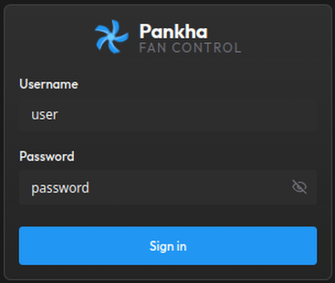
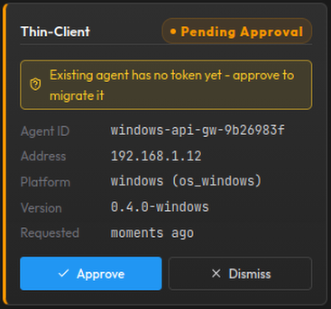
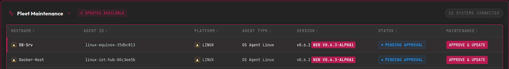

<!-- HOW THIS FILE WORKS:
     Edit sections below as you work toward a release. Delete the ones you don't need.
     The ReleaseTag line declares which release(s) this prose belongs to - the
     workflow uses these notes only when the tag being released matches it
     (shell glob: "v0.6.3*" covers v0.6.3-alpha1 through stable v0.6.3).
     Any other tag gets pure auto-generated categorised notes, so stale prose
     can never leak into the wrong release. A missing ReleaseTag line skips
     the prose with a warning in the workflow log.

     Starting notes for the next release = overwrite the sections below and
     point ReleaseTag at the new tag. Git history of this file preserves the
     authored prose per release; the GitHub Release page is the archive.

     Images: drop files into .github/input/images/ and reference them here as
       
     The workflow uploads each image as a release asset and rewrites the URL to
     the permanent releases/download/... URL automatically. Images are not
     cleaned up automatically - remove stale ones when retargeting. -->

ReleaseTag: v0.6.3*

## Highlights

- **Login and user accounts**: The dashboard now sits behind a login. Three roles - Viewer (watch), Operator (control fans), Admin (everything) - with user management in Settings. First start opens a setup screen to create the admin account.
- **Agent security**: Agents authenticate with per-machine tokens. New machines appear as approval cards on the dashboard instead of registering silently - you decide what joins your fleet.
- **Approve & Update**: Approving an agent that runs an older build also updates it, in the same click. The agent upgrades itself from the Hub cache, reconnects, and is secured automatically.

## Breaking Changes

- **The REST API now requires login.** Anything that calls the API directly (scripts, curl, integrations) must authenticate first and send the session cookie. Cookie-based examples are in the [API Reference](https://github.com/Anexgohan/pankha/wiki/API-Reference).
- **Existing agents need a one-time approval after this upgrade.** They will appear as pending approval cards. Stage this release's binaries in Fleet Maintenance first, then click Approve & Update on each Linux/IPMI agent - it updates and secures itself in one step. Windows agents: install the new MSI on the machine, then approve.
- **Install scripts expire after 24 hours.** A script generated before this upgrade (or older than a day) will not enroll new agents - generate a fresh one from the Deployment page.

## Screenshots

## Notes

- New optional environment variables (reverse-proxy allowlist, session duration, admin reset) are documented on the [Docker and Env](https://github.com/Anexgohan/pankha/wiki/Docker-and-Env) wiki page. Note that `PANKHA_TRUST_PROXY` is now a comma-separated list of proxy IPs/CIDRs.
- Deleting a system on the dashboard no longer uninstalls anything on the machine; a still-running agent simply reappears as a pending card.
