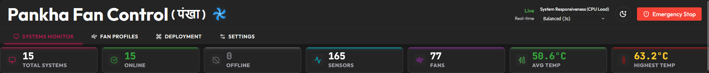
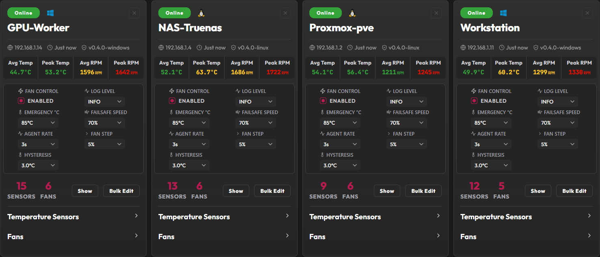
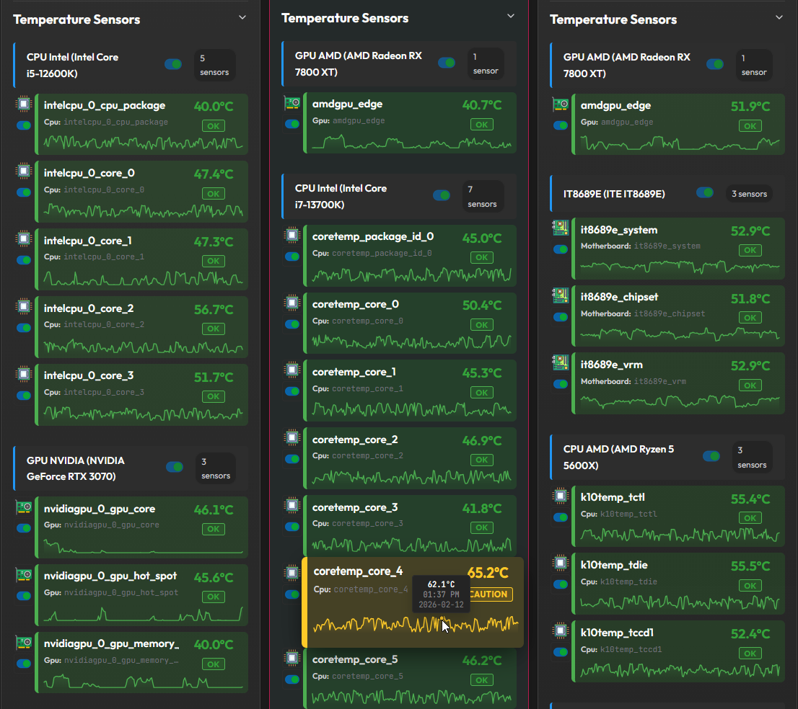
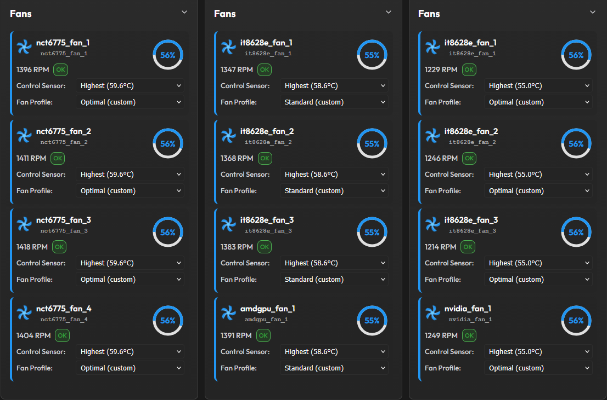
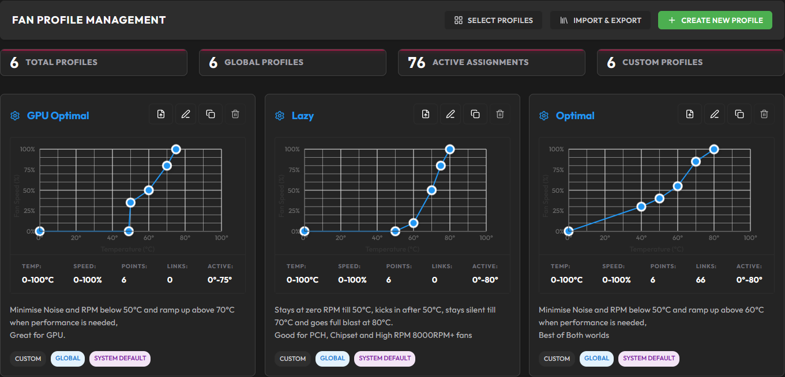
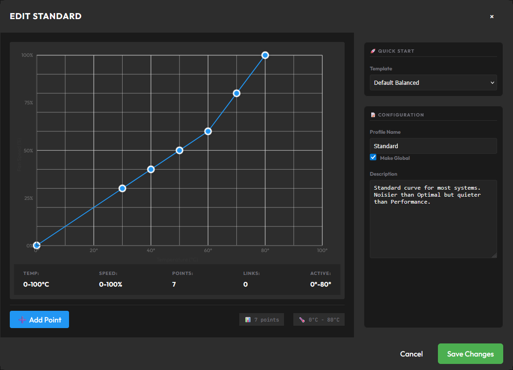
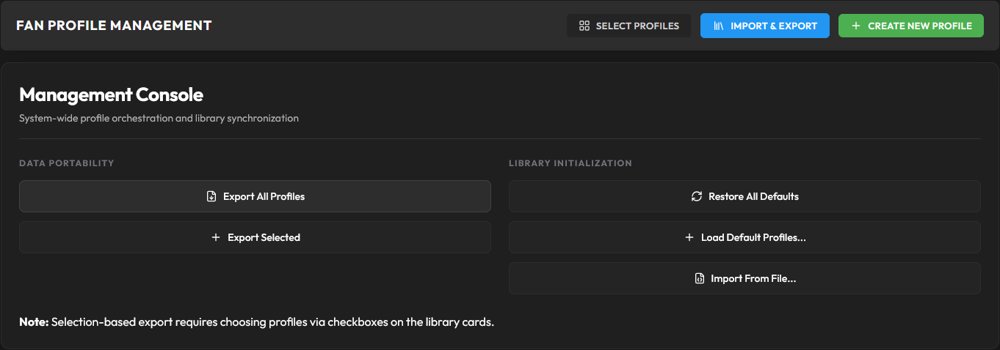

# Pankha Fan Control  (पंखा)

<p align="center">
  <a href="https://demo.pankha.app/"></a>
  <br>
  <sub>No install required</sub>
</p>
<br>
<p align="center">
  <a href="https://pankha.app/"></a>
</p>

**Pankha Fan Control** is an open-source fan and temperature management system for any PC - single desktop, server, or homelab fleet. Build smarter fan curves, lower noise, drop temperatures, and manage every machine from one web dashboard. Works on Windows and Linux. Free, self-hosted, no telemetry.

    
   

     
 



---

## What is Pankha Fan Control?

**Pankha Fan Control** - is open-source software that gives you complete control over your systems cooling. 
Build custom fan curves, monitor temperatures in real time, and tune RPM and noise to your exact preference - on a single desktop, a homelab, or a fleet of servers.

It runs the same way whether you're managing one machine or one hundred. The web dashboard works in any browser, on any device. Agents are lightweight, the backend is self-hosted, and nothing about your hardware ever leaves your network.
Its built to support single Windows or Linux PC or multiple Servers, VM's, NAS boxes, PC's - it can handle any scale.

---
## Features

- **Quieter PCs, cooler temps** - smart fan curves with hysteresis and stepping eliminate the always full throttlenoise and thermal spikes left behind by stock BIOS fan profiles
- **Unify Everything into 'One dashboard'** - unified web UI for one system or 100, on Windows, Linux, or IPMI / BMC-controlled servers, manage fans and temperatures across all your machines, on Windows, Linux, Virtual Machines with passed through devices like GPU, PCIe card, HBA, etc and x64 or ARM from one dashboard
- **Visual profile editor** - drag-and-drop curve editor with import / export so you can build, share, and reuse fan profiles across machines
- **Real hardware control** - direct PWM control with live RPM feedback, per-fan policies, and an always-on emergency-temperature override
- **Real-time monitoring** - temperature, RPM, and historical data for CPU, GPU, NVMe, motherboard, and chipset, streamed live over WebSocket
- **Safe by design** - if the backend is unreachable, agents fall back to a configurable safe fan speed with a local emergency-temperature override
- **Light and fast** - the Linux agent is a single Rust binary using under 15MB RAM and under 1% CPU. The Windows agent runs as a .NET 8 service using under 25MB RAM and under 1% CPU with full LibreHardwareMonitor access. IPMI/BMC Agents use even less resources.
- **Open source, self-hosted** - AGPL-3.0, no cloud, no telemetry. PostgreSQL backend, single-container Docker deployment

---
## Who is Pankha Fan Control for?

**Anyone who wants more control over their cooling than stock tools allow.** From a single quiet desktop to a fleet of servers - same dashboard, same workflow.

- **PC builders and gamers** - replace stock BIOS fan curves with smart custom ones; quieten your desktop without sacrificing thermals
- **Windows users** - a no-cloud, no-account fan utility that doesn't require per-machine setup
- **Linux desktop and server users** - PWM fan control on headless boxes (Debian, Ubuntu, RHEL, Proxmox, TrueNAS) without a GUI
- **Homelabbers and self-hosters** - manage Proxmox hosts, NAS boxes, and virtualisation hosts from one place
- **Server admins** - readable fan curves and a web UI for Dell PowerEdge, HP ProLiant, and Supermicro hardware controlled through IPMI / BMC, cure for always screaming fans even when idle.
- **Anyone managing more than one machine** - configure one or multiple profiles and apply to as many machines as you like.

---
## Screenshots

<table>
  <tr>
    <td align="center"><br><sub>Agent widget</sub></td>
    <td align="center"><br><sub>Temperature sensors</sub></td>
  </tr>
  <tr>
    <td align="center"><br><sub>Fan control with RPM feedback</sub></td>
    <td align="center"><br><sub>Fan profiles</sub></td>
  </tr>
  <tr>
    <td align="center"><br><sub>Customisable profile editor</sub></td>
    <td align="center"><br><sub>Profile import / export</sub></td>
  </tr>
</table>

---
## Quick Start

###  Server (Docker)

```bash
wget -O compose.yml https://github.com/Anexgohan/pankha/releases/latest/download/compose.yml
wget -O .env https://github.com/Anexgohan/pankha/releases/latest/download/example.env
docker compose pull && docker compose up -d
```

Open the dashboard at `http://localhost:3000` (or your configured `PANKHA_PORT`).

[](https://github.com/Anexgohan/pankha/wiki/Server-Installation)

---
###  Linux Agent (Rust)

**A. Recommended - one-line install via Deployment AIO**

In the dashboard, open **Deployment &rarr; Deployment AIO**, configure your options, and copy the generated command. It will look like:

```bash
wget -qO- "http://<your-backend>:<port>/api/deploy/linux?token=<token>" | bash
# or
curl -sSL "http://<your-backend>:<port>/api/deploy/linux?token=<token>" | bash
```

The script auto-detects your CPU architecture, downloads the matching binary, applies the config you set in the GUI, and installs the systemd service.

**B. Manual install**

<details>
<summary>Show x64 / ARM64 manual install (wget or curl)</summary>

#####   Intel / AMD x64

```bash
# wget
wget -O pankha-agent https://github.com/Anexgohan/pankha/releases/latest/download/pankha-agent-linux_x64
# or curl
curl -fsSLo pankha-agent https://github.com/Anexgohan/pankha/releases/latest/download/pankha-agent-linux_x64
chmod +x pankha-agent
```

#####  ARM64 (Raspberry Pi 5, etc.)

```bash
# wget
wget -O pankha-agent https://github.com/Anexgohan/pankha/releases/latest/download/pankha-agent-linux_arm64
# or curl
curl -fsSLo pankha-agent https://github.com/Anexgohan/pankha/releases/latest/download/pankha-agent-linux_arm64
chmod +x pankha-agent
```

Then configure (works for both):

```bash
sudo ./pankha-agent --setup
```

List all commands: `./pankha-agent --help`

</details>

###
[](https://github.com/Anexgohan/pankha/wiki/Agents-Linux)

---
###  Windows Agent (.NET 8)

Download **[pankha-agent-windows_x64.msi](https://github.com/Anexgohan/pankha/releases/latest/download/pankha-agent-windows_x64.msi)** from the latest release. The installer sets up the background service and the tray app. Right-click the tray icon &rarr; **Settings** &rarr; set the backend URL.

[](https://github.com/Anexgohan/pankha/wiki/Agents-Windows)

---
##  How Pankha Fan Control works

     

A central **backend** (Docker container with Node.js, PostgreSQL, and a WebSocket hub) coordinates lightweight **agents** running on each machine you want to control.

**Components**

- **Backend** - Node.js + Express + WebSocket + PostgreSQL, deployed as a single Docker container
- **Frontend** - React + TypeScript + Vite, served by nginx
- **Linux agent** - single Rust binary using <15MB RAM and <1% CPU, `sysfs` hardware access, zero runtime dependencies
- **Windows agent** - self installing .NET 8 service using <25MB RAM and <1% CPU, capable of full LibreHardwareMonitor access to all sensors and fans on any Windows machine

**How it works**

- Agents push sensor and fan readings to the backend over WebSocket every few configurable seconds; the backend computes deltas and broadcasts changes only when needed to minimise bandwidth.
- The backend evaluates your fan curves and sends control commands back to agents in real time
- If the backend is unreachable, agents enter **failsafe mode** - a configurable safe fan speed with a local emergency-temperature override

```
Browser <-HTTP/WebSocket-> Backend (Docker) <-WebSocket-> Agents <-Direct-> Hardware
```

[](https://github.com/Anexgohan/pankha/wiki/Architecture)

##  Documentation

[](https://github.com/Anexgohan/pankha/wiki)

<table>
<tr>
<td align="center" valign="top">


<div align="left">

- [Installation](https://github.com/Anexgohan/pankha/wiki/Server-Installation)
- [Configuration](https://github.com/Anexgohan/pankha/wiki/Server-Configuration)

</div>
</td>
<td align="center" valign="top">


<div align="left">

- [Linux](https://github.com/Anexgohan/pankha/wiki/Agents-Linux)
- [Windows](https://github.com/Anexgohan/pankha/wiki/Agents-Windows)
- [Settings](https://github.com/Anexgohan/pankha/wiki/Agents-Advanced-Settings)

</div>
</td>
<td align="center" valign="top">


<div align="left">

- [API Reference](https://github.com/Anexgohan/pankha/wiki/API-Reference)
- [Fan Profiles](https://github.com/Anexgohan/pankha/wiki/Fan-Profiles)

</div>
</td>
<td align="center" valign="top">


<div align="left">

- [Troubleshooting](https://github.com/Anexgohan/pankha/wiki/Troubleshooting)
- [Build from Source](https://github.com/Anexgohan/pankha/wiki/Development-Build)

</div>
</td>
</tr>
</table>

##  Contributing & Community

- **Discussions** - [GitHub Discussions](https://github.com/Anexgohan/pankha/discussions) for questions, ideas, and hardware reports
- **Issues** - [GitHub Issues](https://github.com/Anexgohan/pankha/issues) for bugs and feature requests
- **Discord** - coming soon
- **Pull Requests welcome** - fork the repo, branch as `feature/<name>`, open a PR. CI runs typecheck (frontend + backend), `cargo check` on the Rust agents, and a Docker build before review.

## License

Pankha Fan Control is licensed under [AGPL-3.0](LICENSE) . Commercial licensing is also available - see [LICENSE-COMMERCIAL.md](LICENSE-COMMERCIAL.md).
