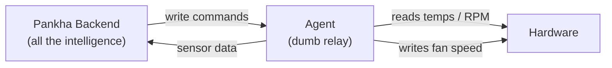

# Agent Philosophy

Pankha Fan Control's agents are **deliberately kept dumb** - and that is a feature, not a limitation. This page explains the design so you know exactly what a Pankha agent can and cannot do on your machines.

## Agents Are Relays, Not Controllers

An agent does exactly two things with your machine:

*   **Read**: sensors (temperatures, fan speeds) and basic system health (CPU load, memory use, uptime).
*   **Write**: fan speeds - and nothing else.

All intelligence lives in the backend. The backend pulls sensor data from the agents, runs the fan curves, hysteresis, and calibration logic, and pushes write commands back. The agent executes them and reports the result. It holds no policy, makes no decisions, and has no opinion about what your fans should do.

Why this matters: the behavior you configured in the dashboard is the behavior you get. There is no hidden agent-side logic to fight with, and a bug or misconfiguration on one agent cannot invent fan policy on its own.

## No Internet Access - By Design, Forever

Agents connect to exactly **one** network destination: your Pankha server, at the URL you configured. That's it.

*   Agent updates come from **your Hub**, not from the internet ([Deployment Center](Deployment-Center) staging).
*   IPMI agents fetch their BMC profiles from **your backend**, not from a vendor site.
*   There is no telemetry, no update-check, no phoning home - and there never will be.

If your agent machines have no internet access at all, nothing about Pankha changes.

## The Two Exceptions: Failsafe and Emergency

The only autonomous behavior an agent has exists to **protect your hardware**, and only activates when the backend cannot:

1.  **Failsafe Mode** - when the agent loses its connection to the backend, it sets all fans to the failsafe speed **you defined** (default 70%; GPU fans are handed back to the graphics driver's own control instead).
2.  **Emergency Override** - while disconnected, the agent keeps watching temperatures locally. If any sensor reaches your emergency threshold, **all fans go to 100%** immediately.

Both thresholds are yours to set, per agent. When the connection returns, the agent exits failsafe and the backend resumes control. So your system is protected in every scenario - connected, disconnected, or mid-outage - without the agent ever being trusted with real decisions.

## Set Up Once, Managed Centrally

Installing the agent is the last time you should need the agent machine. From then on, everything about it is managed from the Pankha dashboard: every setting (update rate, fan control, thresholds, log level), renaming, sensor visibility, calibration - and for Linux and IPMI agents, even version updates arrive remotely from your Hub.

Only two things ever require going back to the agent machine:

*   **Changing the server URL** the agent connects to.
*   **Uninstalling** the agent.

(Windows agents have one more for now: version updates are installed locally by running the new MSI - remote update for Windows is in the works.)

## What Happens When You Stop an Agent

Stopping the agent hands control back to whatever managed the fans before, with one honest caveat:

| Fan type | On agent stop |
| :--- | :--- |
| NVIDIA GPU fans | Returned to the graphics driver's own automatic curve |
| IPMI/BMC fans | BMC restored to factory automatic control |
| Motherboard fans (Linux and Windows) | **Hold their last commanded speed** until the next reboot, when the BIOS takes over again |

---

## Next Steps

*   [Fan Profiles & Logic](Fan-Profiles): how the backend decides fan speeds.
*   [Advanced Settings](Agents-Advanced-Settings): failsafe speed, emergency temperature, and the other per-agent settings.
*   [Linux Agent](Agents-Linux) / [Windows Agent](Agents-Windows): installing the agents.
