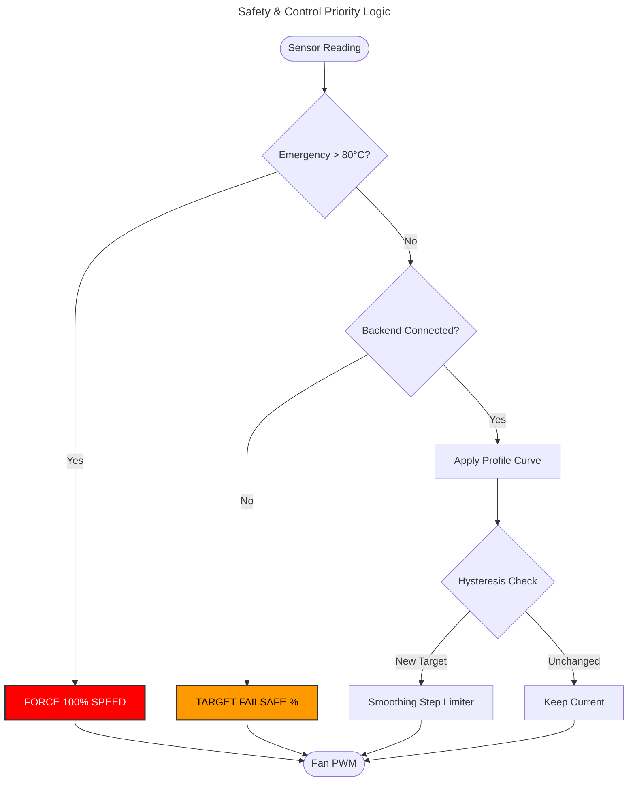
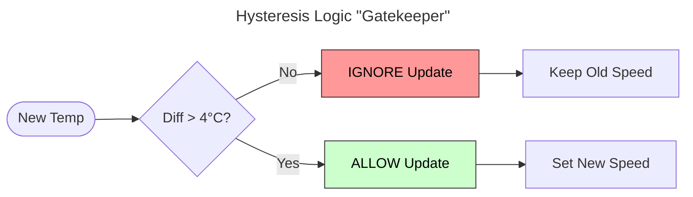
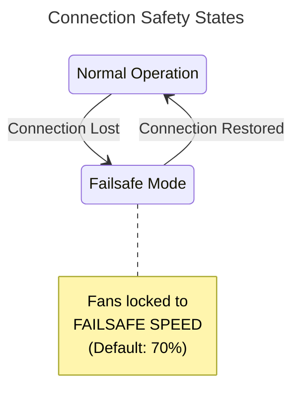
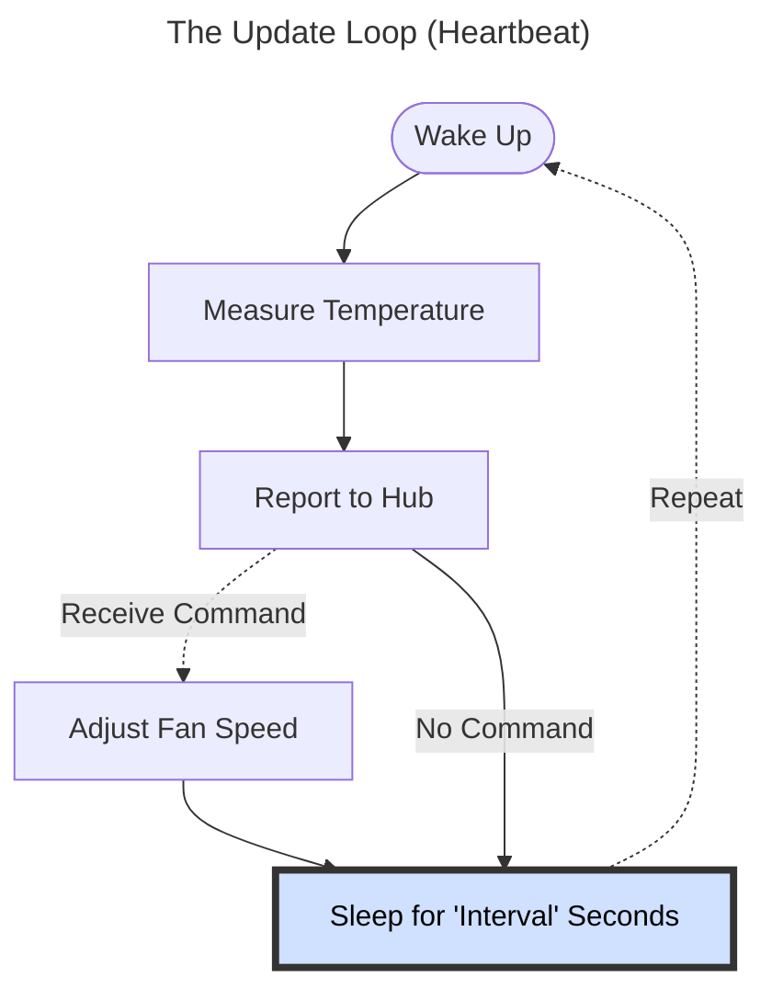

# Advanced Configuration

Each agent has specific settings to fine-tune its behavior. You can edit these in the **Configuration** section of any system card on the dashboard.

## Temperature Control

### Hysteresis (Start/Stop Delay)
*   **Purpose**: Prevents fans from "revving" up and down constantly due to micro-fluctuations in temperature (e.g., CPU jumping from 40°C to 45°C for 1 second).
*   **How it works**: If `Hysteresis` is set to **4°C**, the fan speed will NOT change until the temperature changes by at least 4°C from the last update point.
*   **Example**:
    *   Temp: 50°C -> Fan: 40%
    *   Temp rises to 53°C (Change < 4°C) -> **Ignored** (Fan stays at 40%)
    *   Temp rises to 55°C (Change > 4°C) -> **Update** (Fan increases to new target)

### Emergency Temperature
*   **Purpose**: Failsafe protection for hardware safety.
*   **How it works**: If any sensor reaches this threshold (default **80°C**), the agent **ignores all profiles, hysteresis, and smoothing**.
*   **Action**: All fans are immediately forced to **100% speed** to protect hardware.
*   **Offline Failsafe**: When the agent loses connection to the backend, it continues monitoring temperatures locally. If any sensor hits the emergency threshold while disconnected, the agent autonomously triggers 100% fan speed—**no backend required**.

### Failsafe Speed
*   **Purpose**: Hardware protection when agent loses connection to backend.
*   **How it works**: When disconnected, the agent sets ALL fans to this speed percentage.
*   **Default**: 70%
*   **Why it matters**:
    *   Ensures cooling continues during backend outages
    *   Configurable: 0-100% (30-70% recommended)
    *   Works with Emergency Temperature: if any sensor ≥ `emergency_temp`, fans go to 100%
*   **Windows Special Case**: GPU fans go to "auto" (driver control), other fans use `failsafe_speed`.

### Enable Fan Control
*   **Purpose**: Toggle whether this agent can control fans.
*   **When Disabled**: Agent is read-only (monitoring only, no fan speed commands accepted).
*   **Use Case**: Temporarily disable control during maintenance or testing.

---

## Fan Behavior

### Fan Step % (Smoothing)
*   **Purpose**: Makes speed transitions smooth and pleasing to the ear, avoiding sudden "jet engine" spin-ups.
*   **How it works**: Limits how much the fan speed can change per update cycle (approx. every 2 seconds).
*   **Example**:
    *   Current Speed: 30%
    *   Target Speed: 100%
    *   Fan Step: **5%**
    *   **Result**: The fan will go 30% -> 35% -> 40% ... taking several seconds to reach 100%.

### Agent Rate (Update Interval)
*   **Default**: 3000ms (3 seconds).
*   **Description**: How often the agent reads sensors and updates fan speeds.
*   **Trade-off**:
    *   Lower values (1s) = More responsive, higher CPU usage.
    *   Higher values (5s+) = Very stable, negligible CPU usage.

---

## Agent Identity

### Agent Name
*   **Purpose**: Display name shown on the dashboard.
*   **How it works**: Can be changed via dashboard settings or `config.json`.
*   **Default**: System hostname.

---

## Sensor Visibility

You can hide individual sensors or entire sensor groups from the dashboard. This keeps your view clean and also affects fan control behavior.

### Hiding Sensors

*   Click the **visibility toggle** (eye icon) next to any sensor to hide or show it.
*   You can also hide an **entire sensor group** (e.g., all `gigabyte_wmi` sensors) at once using the group-level toggle.
*   Use the **"Show Hidden Sensors"** toggle to temporarily reveal hidden sensors for review.

### How Visibility Affects Fan Control

Hidden sensors are **excluded** from the **Highest Temperature** (`__highest__`) calculation. This means:

*   If a fan's control sensor is set to "Highest", only **visible** sensors contribute to the maximum temperature.
*   Hiding a noisy or irrelevant sensor (e.g., a chipset sensor that always reads high) prevents it from driving your fans unnecessarily.
*   Sensors assigned **directly** to a fan (e.g., "CPU Package") are always used, regardless of visibility.

> **Example**: Your motherboard has a VRM sensor that consistently reads 75°C. If your case fan is set to "Highest", this sensor would keep the fan spinning fast. Hiding it excludes it from the calculation, and the fan responds only to sensors you care about.

---

## Debugging

### Log Level
*   **Purpose**: Controls the verbosity of the agent's internal logs (viewable via the Tray App or `agent.log`).
*   **Options**:
    *   **Error**: Only critical failures.
    *   **Warn**: Issues that don't stop operation.
    *   **Info** (Default): Normal operational events.
    *   **Debug**: Detailed hardware reading info.
    *   **Trace**: Extreme detail (every raw byte/packet).
