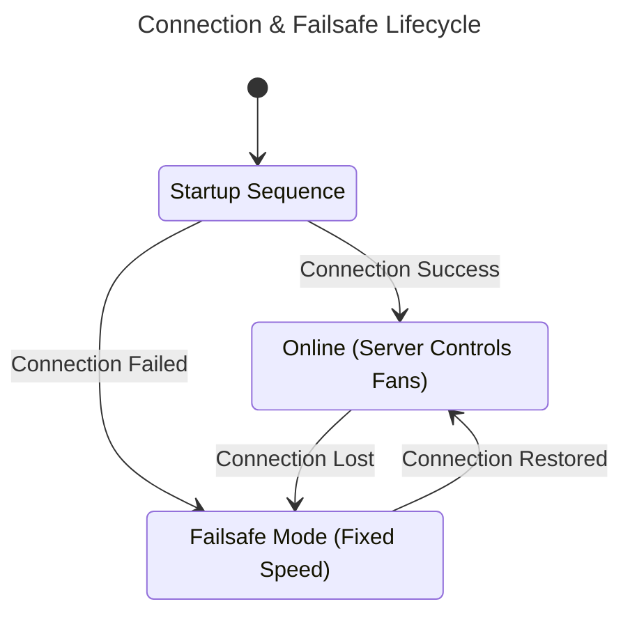

# Linux Agent

The Pankha Linux agent is a lightweight, single-binary application written in Rust. It reads temperatures and controls PWM fans directly through the Linux kernel's `sysfs` interface - no Python, no runtime dependencies, nothing else to install.

## Features

*   **Zero Dependencies**: One static binary. Download, run.
*   **Low Resource Usage**: Typically <10MB RAM and <1% CPU.
*   **Broad Hardware Support**: Any sensor or PWM fan the kernel exposes via `hwmon` (everything `lm-sensors` can see).
*   **NVIDIA GPU Support**: On systems with the NVIDIA driver, the GPU shows up as an extra temperature sensor and a controllable fan - no configuration needed.
*   **Failsafe Mode**: If the server becomes unreachable, fans hold a configurable failsafe speed (default 70%) and the GPU fan returns to driver control. Local emergency-temperature monitoring stays active. See [Advanced Settings](Agents-Advanced-Settings).
*   **Deliberately Simple**: The agent is a dumb relay - all control logic lives on your server, and the agent never connects to anything but it. See [Agent Philosophy](Agent-Philosophy).



## Installation

> **Root privileges are required.** Fan control writes to `/sys` are root-only, and installing the systemd service needs root too - the agent runs as a root service. Run the setup commands with `sudo` (the Deployment Center's install command handles this itself, using `sudo` when not run as root). Without root, the agent can at best read sensors - it cannot control fans.

There are three ways to install - pick **one**:

| Path | Best for |
| :--- | :--- |
| **A. Deployment Center** (recommended) | You already have the Pankha server running |
| **B. Download + setup wizard** | You prefer doing it by hand, guided |
| **C. Fully manual** | Scripted/automated provisioning |

> **Important**: whichever path you choose, make sure you end up with the **systemd service installed**. The service is what starts the agent on boot - without it, the agent stays stopped after every reboot and your fans run on BIOS defaults until you start it by hand. Path A installs the service automatically; path B asks you during the wizard; path C installs it with `--install-service`.

### Option A: Deployment Center (Recommended)

Open your dashboard's **[Deployment Center](Deployment-Center)**, configure the agent visually, and copy the generated one-line install command. Run it on the target machine - it downloads the binary from your own server, writes the configuration, installs the systemd service, and starts the agent. The agent appears on your dashboard within seconds.

### Option B: Download + Setup Wizard

**1. Download** the binary for your architecture from the [Releases Page](https://github.com/Anexgohan/pankha/releases):

**x64 (Intel/AMD)**:
```bash
mkdir -p /opt/pankha-agent && cd /opt/pankha-agent
wget -O pankha-agent https://github.com/Anexgohan/pankha/releases/latest/download/pankha-agent-linux_x64
chmod +x pankha-agent
```

**ARM64 (Raspberry Pi/SBC)**:
```bash
mkdir -p /opt/pankha-agent && cd /opt/pankha-agent
wget -O pankha-agent https://github.com/Anexgohan/pankha/releases/latest/download/pankha-agent-linux_arm64
chmod +x pankha-agent
```

**2. Run the setup wizard** (as root, so it can install the service and control fans):

```bash
sudo ./pankha-agent --setup
```

The wizard walks you through, with sensible defaults in `[brackets]` - press Enter to accept them. A typical first run:

```text
╔══════════════════════════════════════╗
║    Pankha Rust Agent Setup Wizard    ║
╚══════════════════════════════════════╝
Build: pankha-agent v0.6.1 (x86_64)

Configuration:

Values in [brackets] are defaults - press Enter to use them.

Agent Name [my-server]: living-room-nas
Backend Server URL [ws://192.168.1.50:3143/websocket]:
Update Interval (seconds) [3]:
Enable Fan Control? (Y/n): y
Failsafe speed when backend disconnected (0-100%, default 70):

Configuration saved to: "/opt/pankha-agent/config.json"

Test hardware discovery now? (Y/n): y

Testing hardware discovery...

Discovered 12 sensors and 4 fans

Sensors:
  • CPU AMD Tctl - 48.5°C
  • Storage Composite - 41.0°C
  • Motherboard ITE Sensor 1 - 39.0°C
  ... and 9 more

Fans:
  • Motherboard Fan 1 - 826 RPM
  • Motherboard Fan 2 - 654 RPM

Auto-start service not installed
   Install systemd service to start agent on boot? [Y/n]: y

Setup complete!
```

What each prompt decides:

*   **Agent Name** - display name on the dashboard (defaults to the hostname).
*   **Backend Server URL** - your Pankha server, in the form `ws://<server-ip>:3143/websocket`.
*   **Update Interval** - how often the agent reports data (seconds).
*   **Enable Fan Control** - allow this agent to control fans (yes for normal use).
*   **Failsafe speed** - fan speed to hold if the server becomes unreachable.
*   **Test hardware discovery** - optional immediate scan; shows the sensors and fans found.
*   **Install systemd service** - answer **yes**. This is what brings the agent back after a reboot; skip it and Pankha stays stopped from the next boot onward.

Re-running `--setup` later is safe: it asks before overwriting the existing configuration and offers your current values as the defaults.

### Option C: Fully Manual

For scripted setups: place the binary and a `config.json` next to each other (a commented `config.example.json` ships with every [release](https://github.com/Anexgohan/pankha/releases)), then install the service:

```bash
sudo ./pankha-agent --install-service    # creates + starts the systemd service
sudo ./pankha-agent --uninstall-service  # removes it
```

The service file is generated at `/etc/systemd/system/pankha-agent.service` using the binary's actual location - no hardcoded paths.

## Where Files Are Stored

```text
/opt/pankha-agent/           # or wherever you placed the binary
├── pankha-agent             # The binary executable
├── config.json              # Local configuration file
└── hardware-info.json       # Hardware discovery snapshot

/var/log/pankha-agent/
└── agent.log                # Running logs

/etc/systemd/system/
└── pankha-agent.service     # Systemd service definition
```

> **Portable installs** (agent deployed to a home directory via the Deployment Center's Portable mode) keep logs next to the binary instead of `/var/log/`. Everything else behaves identically.

## Managing the Agent

Day to day you should rarely need this - once the agent is installed, all its settings, calibration, and even version updates are handled from the dashboard ([Agent Philosophy](Agent-Philosophy)). The CLI is for the two things that stay local - changing the server URL (`--setup`) and uninstalling - plus on-machine status checks:

```bash
./pankha-agent -i        # Status
./pankha-agent -l        # Follow live logs
./pankha-agent -x        # Stop
./pankha-agent -s        # Start
./pankha-agent -r        # Restart
```

`--stop` and `--restart` are systemd-aware: if the service manages the agent, they delegate to `systemctl` so the service doesn't immediately restart it behind your back. The standard systemd commands work too:

```bash
systemctl status pankha-agent
journalctl -u pankha-agent -f
```

## CLI Commands

Run `./pankha-agent --help` (or `-h`) at any time for the full list of commands:

| Command                   | Short | Description                                                                 |
| ------------------------- | ----- | --------------------------------------------------------------------------- |
| `--start`                 | `-s`  | Start the agent daemon in background                                        |
| `--stop`                  | `-x`  | Stop the agent daemon                                                       |
| `--restart`               | `-r`  | Restart the agent daemon                                                    |
| `--status`                | `-i`  | Show agent status                                                           |
| `--config`                | `-c`  | Show current configuration                                                  |
| `--setup`                 | `-e`  | Run interactive setup wizard                                                |
| `--install-service`       | `-I`  | Install systemd service for auto-start on boot                              |
| `--uninstall-service`     | `-U`  | Uninstall systemd service                                                   |
| `--log-show [<LOG_SHOW>]` | `-l`  | Show agent logs (tail -f by default, or tail -n <lines> if provided)        |
| `--log-level <LOG_LEVEL>` |       | Set log level (TRACE, DEBUG, INFO, WARN, ERROR). Use with --start/--restart |
| `--check`                 |       | Run health check (verify config, service, directories)                      |
| `--test`                  |       | Test mode (hardware discovery only)                                        |
| `--help`                  | `-h`  | Print help                                                                  |
| `--version`               | `-V`  | Print version                                                               |

---

## Next Steps

*   [Deployment Center](Deployment-Center): deploy more agents and manage updates across your fleet.
*   [Advanced Settings](Agents-Advanced-Settings): update rate, hysteresis, fan step, emergency temperature, failsafe speed.
*   [Fan Profiles & Logic](Fan-Profiles): assign curves to your fans.
*   [Troubleshooting](Troubleshooting): if sensors or fans are missing.
