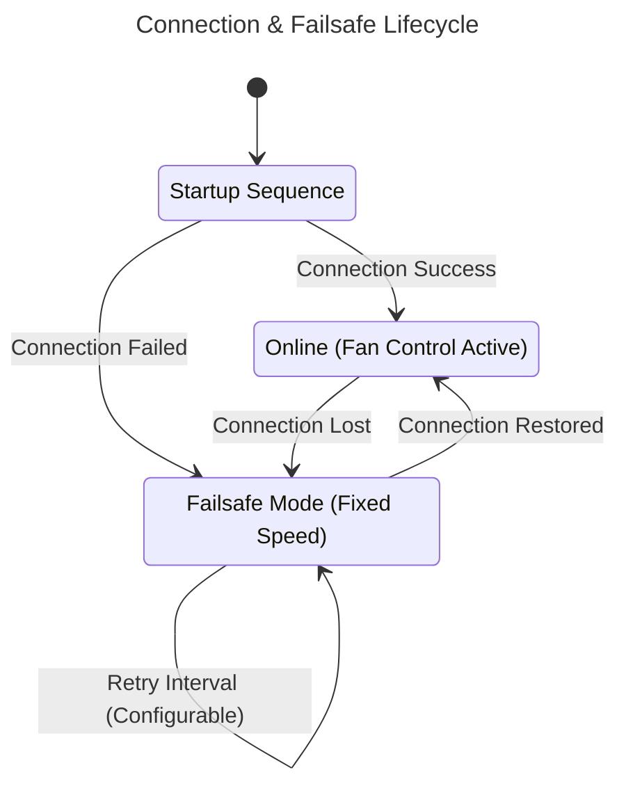

# Windows Agent

The Pankha Windows Agent is a native .NET 8 application that runs as a Background Service, with an accompanying System Tray application for easy management.

## Features
*   **Two-Process Architecture**: Background Service handles hardware access; Tray App provides GUI control.
*   **LibreHardwareMonitor**: Full GPU, CPU, motherboard sensor support.
*   **Failsafe Mode**: Autonomous fan control when disconnected (GPU → auto, others → `failsafe_speed`).
*   **Ring0 Driver**: Kernel driver for low-level hardware access (auto-extracted on first run).



## Installation

1.  **Download**: Get the latest `pankha-agent-windows_x64.msi` from the [Releases Page](https://github.com/Anexgohan/pankha/releases).
2.  **Install**: Run the installer. Accept the UAC prompt to allow the service to be registered.
3.  **Verify**:
    *   A "Fan" icon should appear in your System Tray.
    *   The service `PankhaAgent` should be running in Windows Services.

## Configuration

1.  Right-click the **Pankha Tray Icon**.
2.  Select **Settings**.
3.  Enter your **Backend URL** (e.g., `ws://192.168.1.50:3143/websocket`).
4.  Click **Save & Restart**.

The agent will automatically restart and attempt to connect.

### File System Layout

```text
C:\Program Files\Pankha Fan Control\
├── PankhaAgent.exe      # Background Service (Core Logic)
├── PankhaTray.exe       # System Tray App (GUI)
├── config.json          # Agent settings
├── hardware-info.json   # Cached hardware discovery data
└── logs/
    └── agent.log        # Detailed log files
```

## Troubleshooting

### Logs
Logs are stored in the installation directory (typically `C:\Program Files\Pankha Fan Control\logs`). You can also view live logs via the Tray Icon:
*   Right-click Tray -> **View Logs**.

### Service Not Starting
If the service fails to start, ensure you have the **.NET 8 Runtime** installed. The installer should verify this, but a manual install may be required on older systems.

### Sensors Not Detected
The agent uses **LibreHardwareMonitor**. 
*   Ensure you are running the service as **SYSTEM** (default).
*   Some anti-cheat software (like Vanguard) may block hardware access.
