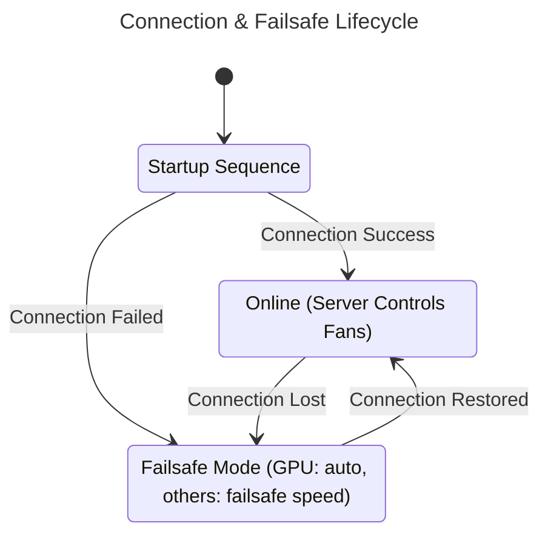

# Windows Agent

The Pankha Windows Agent is a native .NET 8 application that runs as a background Windows Service, with a System Tray app for status and configuration. It monitors your sensors through LibreHardwareMonitor and controls fans on command from your Pankha server.

## Features

*   **Two-Process Design**: The service (`pankha-agent.exe`) runs with SYSTEM privileges for hardware access, even before anyone logs in. The tray app (`pankha-tray.exe`) runs in your session with normal user rights.
*   **Wide Hardware Support**: CPU, GPU, motherboard, and drive sensors via LibreHardwareMonitor; NVIDIA GPU fan control via NvAPI.
*   **Signed Kernel Driver**: Motherboard and drive sensors require the PawnIO driver - digitally signed, installed by the MSI.
*   **Self-Contained**: The .NET runtime is embedded. Nothing else to install.
*   **Failsafe Mode**: If the server becomes unreachable, GPU fans return to driver control and all other fans hold a configurable failsafe speed. See [Advanced Settings](Agents-Advanced-Settings).
*   **Deliberately Simple**: The agent is a dumb relay - all control logic lives on your server, and the agent never connects to anything but it. See [Agent Philosophy](Agent-Philosophy).


```mermaid
---
title: Connection & Failsafe Lifecycle
---
stateDiagram-v2
    [*] --> Startup

    state "Startup Sequence" as Startup
    state "Online (Server Controls Fans)" as Online
    state "Failsafe Mode (GPU: auto, others: failsafe speed)" as Failsafe

    Startup --> Online : Connection Success
    Startup --> Failsafe : Connection Failed

    Online --> Failsafe : Connection Lost
    Failsafe --> Online : Connection Restored
```

## Installation

> **Administrator rights are required.** The installer needs them to register the service and install the PawnIO driver (it elevates itself - you just approve the UAC prompt). After install, the service runs as SYSTEM automatically, which is what grants it hardware access - no ongoing action needed from you. Only the CLI commands need an Administrator terminal.

1.  **Download**: Get the latest `pankha-agent-windows_x64.msi` from the [Releases Page](https://github.com/Anexgohan/pankha/releases). The [Deployment Center](Deployment-Center) in your dashboard links to the same file.
2.  **Run the installer and pass the Windows warnings**: because the MSI is a downloaded file from an unrecognized publisher, Windows shows up to two dialogs before the installer opens:
    *   SmartScreen ("Windows protected your PC"): click **More info** (1), then **Run anyway** (2).
    *   User Account Control: click **Yes** (3) - the installer needs administrator rights to register the service.


3.  **Follow the setup wizard**:


4.  **Choose the install location** (default: `C:\Program Files\Pankha Fan Control\`).


5.  **Setup options**: Keep the defaults on a first install.


    *   **Reset configuration (Clean Install)**: leave unchecked to preserve your existing `config.json` and logs when upgrading; check it to start fresh (deletes both).
    *   **Install PawnIO Driver**: required for motherboard and drive sensors and fan control. If PawnIO is already on the system, the installer detects it and skips this step. The installation fails rather than leaving you with a half-working agent, so leave this checked.

6.  **Verify**: after the installer finishes, the Pankha fan icon appears in your System Tray. The `PankhaAgent` service is now running (check with `services.msc` if curious).


> **Upgrading?** Just run the newer MSI. The old version is removed automatically and your configuration is preserved unless you choose a clean install.

## Connecting to Your Server

1.  Right-click the **Pankha tray icon** and choose **Configure...**
2.  In the **Backend Connection** section, enter your server's WebSocket URL, e.g. `ws://192.168.1.50:3143/websocket`.
3.  Click **Save**. The service applies the change immediately - no restart needed - and the agent appears on your dashboard within seconds.


The same window covers agent name, update rate, fan behavior, and logging - the dropdowns offer the same values as the web dashboard, and changes made in either place stay in sync.

> The configuration window talks to the service. If it shows "Failed to load (Service not running?)", start the service first (tray menu: **Start Service**).

## Day-to-Day Management

Once the agent is connected, its settings live in the dashboard - the tray app is only needed for what stays local: the server URL, service control, and logs ([Agent Philosophy](Agent-Philosophy)). Everything routine is in the tray menu:

| Menu item           | What it does                                    |
| ------------------- | ----------------------------------------------- |
| **Status...**       | Connection state, agent ID, live sensor summary |
| **Configure...**    | Open the configuration window                   |
| **View Logs**       | Live log view                                   |
| **Start / Stop / Restart Service** | Control the background service   |
| **Exit**            | Close the tray app (the service keeps running)  |

Hovering the tray icon shows a quick tooltip with current temperatures and fan speeds. The icon switches to a warning symbol when the agent loses its server connection.


The **Status...** window gives the full picture - connection, discovered hardware, uptime, and version:


The Start Menu folder ("Pankha Fan Control") offers the same actions plus an uninstall shortcut.

### Command Line

For scripting or remote sessions, the agent has a CLI (run from the install directory, as Administrator):

```cmd
pankha-agent.exe --status        # Status and recent logs
pankha-agent.exe --start         # Start service
pankha-agent.exe --stop          # Stop service
pankha-agent.exe --restart       # Restart service
pankha-agent.exe --setup         # Interactive setup wizard
pankha-agent.exe --config-show   # Display current configuration
pankha-agent.exe --logs follow   # Live log tail
pankha-agent.exe --logs 50       # Last 50 log lines
pankha-agent.exe --test          # Hardware discovery test
```

## File Locations

```text
C:\Program Files\Pankha Fan Control\
├── pankha-agent.exe     # Background service (core logic)
├── pankha-tray.exe      # System tray app (GUI)
├── PawnIO_setup.exe     # Bundled kernel driver installer
├── config.json          # Agent settings
├── hardware-info.json   # Hardware discovery snapshot
└── logs\
    └── pankha-agent.log # Agent log files

C:\ProgramData\Pankha Fan Control\logs\
└── install.log          # Installer logs (install/uninstall/upgrade)
```

## Uninstalling

Uninstall from Windows **Settings > Apps** (or the Start Menu shortcut). Running the MSI again on an installed system opens the maintenance dialog instead:


The uninstaller asks whether to keep `config.json` and logs - keep them if you plan to reinstall later.

## Troubleshooting

### Sensors or fans missing
The usual cause is the PawnIO driver not being installed. Verify `C:\Windows\System32\drivers\PawnIO.sys` exists; if not, run the bundled installer from the install directory:
```cmd
PawnIO_setup.exe -install -silent
```
A reboot may be required before the driver is active. Note that some anti-cheat software (e.g. Vanguard) blocks hardware access entirely.

### Tray shows "Disconnected"
1.  Check the service is running: tray menu **Start Service**, or `sc query PankhaAgent`.
2.  Check the Backend URL in **Configure...** - the IP must be reachable from this machine (not `localhost` unless the server runs on it).
3.  Check the server is up: open `http://<server-ip>:3143` in a browser.

### Logs
Tray menu **View Logs**, or `logs\pankha-agent.log` in the install directory. Installer issues are logged separately under `C:\ProgramData\Pankha Fan Control\logs\`.

For anything else, see [Troubleshooting](Troubleshooting).

---

## Next Steps

*   [Advanced Settings](Agents-Advanced-Settings): update rate, hysteresis, fan step, emergency temperature, failsafe speed.
*   [Fan Profiles & Logic](Fan-Profiles): assign curves to your fans.
*   [Deployment Center](Deployment-Center): keep an eye on agent versions across your fleet.
