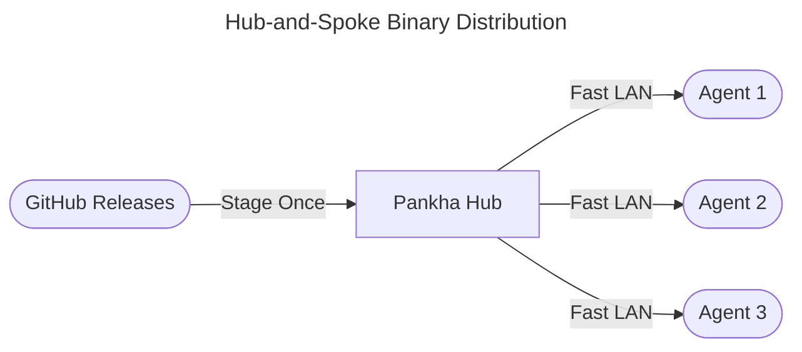
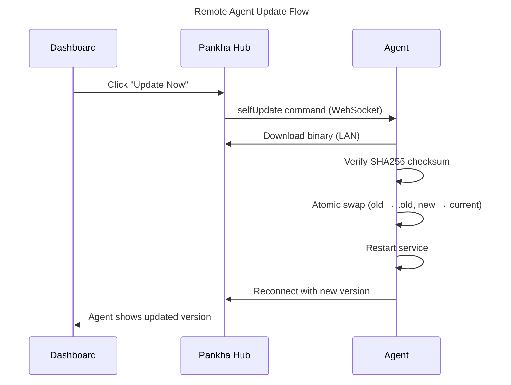

# Deployment Center

The Deployment Center is your hub for provisioning new agents and maintaining your fleet. Access it from the **Deployment** tab in the navigation bar.

> If no agents are connected yet, the dashboard shows a shortcut card directing you here.

## Fleet Overview

Three metric cards at the top give a quick snapshot:


| Metric           | Description                                                    |
| :--------------- | :------------------------------------------------------------- |
| **Total Agents** | Number of registered agents across all systems                 |
| **Online Now**   | Currently connected agents                                     |
| **Outdated**     | Agents running an older version than the latest release        |

---

## Deploy a New Agent

The deploy workspace is a numbered set of steps on the left with a **live summary on the right** - it updates as you configure, and holds the final install command. Work top to bottom, then copy the command when the summary looks right.

### Step 1: Platform & Architecture

One card per agent type - picking a card and a CPU architecture chip does both at once:


| Platform    | Architectures | Runs on                                        |
| :---------- | :------------ | :--------------------------------------------- |
| **Linux**   | x64, arm64    | Debian, Ubuntu, Proxmox, Raspberry Pi, any systemd distro |
| **Windows** | x64           | Windows 10/11 (self-contained .NET 8 service + tray app) |
| **IPMI**    | x64           | Enterprise servers with a BMC (iDRAC, Supermicro, and others) |

A small dot on an architecture chip means that binary is already **cached on your Hub** (see Step 2).

### Step 2: Release & Hub Cache

Pick a channel, fetch the release to the Hub, then deploy from there. The step shows the latest **Stable** and **Pre-release** versions side by side with their release dates:


Clicking **Download Stable** (or **Download Pre-release**) stages the whole release bundle on your Hub in one go - Linux x64 and arm64, IPMI, and the Windows MSI - each verified by checksum. The **Hub cache** list below shows exactly what's staged; the Windows MSI can be downloaded straight from its row, and **Clear all** empties the cache.


```mermaid
---
title: Hub-and-Spoke Binary Distribution
---
graph LR
    GitHub([GitHub Releases]) -->|Stage Once| Hub[Pankha Hub]
    Hub -->|Fast LAN| Agent1([Agent 1])
    Hub -->|Fast LAN| Agent2([Agent 2])
    Hub -->|Fast LAN| Agent3([Agent 3])
```

> **Why stage?** One internet download instead of one per machine - and it works for agent machines with no internet access at all.

### IPMI Only: BMC Profile (appears as step 3)

If you selected the **IPMI** platform, an extra step appears here and the later steps shift down by one. IPMI agents need a vendor profile that tells them which commands their BMC understands:

*   **Select from Catalog**: pick your server's vendor and model family from the built-in profiles.
*   **Build Custom Profile**: open the Profile Builder to create one for unsupported hardware - it lets you define fan zones and test raw IPMI commands against a live agent before saving.

Deploying Linux or Windows? This step doesn't appear - continue below.

### Step 3: Install & Connection


**Install mode** - where the agent lives on the target machine:

| Mode                   | Install path                             | Log path                            |
| :--------------------- | :--------------------------------------- | :---------------------------------- |
| **Standard** (`/opt/`) | `/opt/pankha-agent/`                     | `/var/log/pankha-agent/`            |
| **Portable**           | Current working directory (e.g. `~/pankha/`) | Same directory as the agent binary  |

> Both modes are functionally identical - same systemd service, same features. Only the file locations differ.

**Connection** - how the agent reaches your Hub. **Internal** uses your server's LAN address, right for agents on the same network. **External** is for agents that reach the Hub at a public URL (e.g. behind a reverse proxy):


The **Hub URL** field is editable either way - agents call this URL on every poll, so it must be reachable from the agent's network.

### Step 4: Runtime Defaults

These settings are baked into the agent's configuration when the install script runs (all changeable later from the dashboard):


| Setting            | Options                | Default | Description                                                    |
| :----------------- | :--------------------- | :------ | :------------------------------------------------------------- |
| **Log Level**      | TRACE to ERROR         | INFO    | Verbosity of agent logs                                        |
| **Emergency °C**   | 60-100°C               | 85°C    | All fans go to 100% if any sensor reaches this temperature     |
| **Failsafe Speed** | 0-100%                 | 70%     | Fan speed when the agent loses connection to the Hub           |
| **Agent rate**     | 0.5-30 seconds         | 3s      | How often the agent reads sensors and reports data             |
| **Fan Step**       | 2-50%, or Disable      | 5%      | Maximum fan speed change per update cycle (smooth transitions) |
| **Hysteresis**     | 0.5-10°C, or Disable   | 2.0°C   | Minimum temperature change before a fan adjusts                |

> See [Advanced Settings](Agents-Advanced-Settings) for what each setting does in detail.

### The Summary Panel: Copy and Run

The right-hand panel recaps every choice and holds the install command, with a **wget/curl** toggle:


Click **Copy Deploy Command** and run it on the target machine, as root (or as a user with `sudo` - the script escalates on its own):

```bash
# Example (your command will have a unique token)
wget -qO- "http://192.168.1.100:3143/api/deploy/linux?token=abc123" | bash
```

The script downloads the agent from your Hub, writes the configuration, installs the systemd service, and starts the agent - it self-registers and appears on your dashboard within seconds. IPMI deployments work the same way with their own script and include the selected BMC profile.

Two properties make the command fleet-friendly:

*   **Reusable**: the same command works on as many machines as you like while its token is valid - paste it on every target node, no need to generate one per machine.
*   **Architecture-aware**: before installing, the script detects the machine's CPU architecture and downloads the matching binary from your Hub (x86_64 or aarch64) - so one command covers a mixed fleet. On an unsupported architecture it stops with a clear error before changing anything.

For **Windows**, the summary provides the MSI download link instead - run the installer on the target machine (see [Windows Agent](Agents-Windows)).

> **Token expiry**: the command's token is valid for **24 hours** from generation. After that the server rejects it ("Invalid or expired token") - just generate a fresh command.

---

## Existing Fleet

The fleet table below the deploy workspace lists every agent with its platform, type, version, and status (Online, Offline, Error, or Updating). Version badges flag agents that don't match your staged version - **NEW** for updates, **DOWNGRADE** if the staged version is older.


### Updating Linux and IPMI Agents

1.  **Stage the target version** (Step 2 above).
2.  Click **Update Now** on an agent's row.
3.  The agent downloads the binary from your Hub, verifies the SHA256 checksum, swaps it atomically, and restarts - it reconnects with the new version in a few seconds.


```mermaid
---
title: Remote Agent Update Flow
---
sequenceDiagram
    participant User as Dashboard
    participant Hub as Pankha Hub
    participant Agent as Agent

    User->>Hub: Click "Update Now"
    Hub->>Agent: selfUpdate command (WebSocket)
    Agent->>Hub: Download binary (LAN)
    Agent->>Agent: Verify SHA256 checksum
    Agent->>Agent: Atomic swap (old → .old, new → current)
    Agent->>Agent: Restart service
    Agent->>Hub: Reconnect with new version
    Hub->>User: Agent shows updated version
```

### Updating Windows Agents

Remote update for Windows agents is in the works. Until then, their row offers a **Download MSI** link - run it on the Windows machine; your settings are preserved automatically.

---

## Resources

The Resources section links to the documentation hub, the per-platform service guides, advanced settings, and the issue tracker.

---

## Next Steps

*   [Advanced Settings](Agents-Advanced-Settings): fine-tune agent behavior after deployment.
*   [Fan Profiles & Logic](Fan-Profiles): set up fan curves for your newly deployed agents.
*   [Troubleshooting](Troubleshooting): if an agent doesn't appear after deployment.
