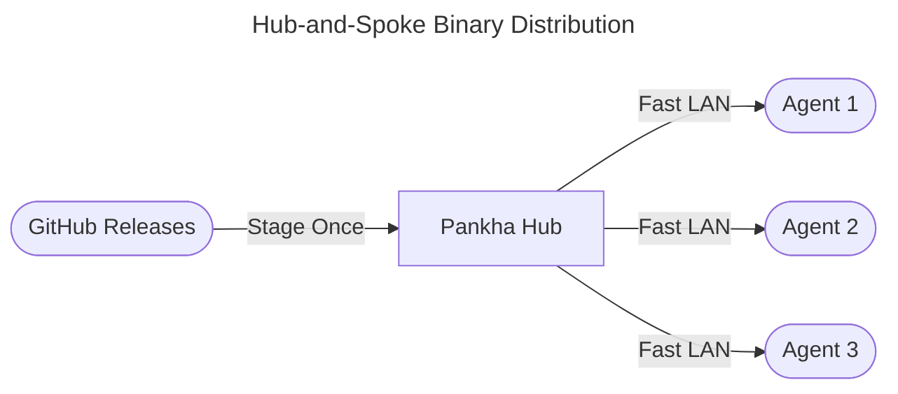

# Deployment Center

The Deployment Center is your hub for provisioning new agents, managing updates, and maintaining your fleet. Access it from the **Deployment** tab in the navigation bar.

> If no agents are connected yet, the dashboard will show a shortcut card directing you to this page.

## Fleet Overview

At the top, three metric cards give you a quick snapshot of your fleet:

| Metric          | Description                                |
| :-------------- | :----------------------------------------- |
| **Total Agents** | Number of registered agents across all systems |
| **Online Now**   | Currently connected agents                 |
| **Outdated**     | Agents running an older version than what's staged on the Hub |

---

## Official Installers

Direct download links for agent installers:

*   **Windows Agent**: Download the MSI installer from the latest GitHub release. Supports Windows 10/11 (x86_64). See [Windows Agent](Agents-Windows) for setup details.
*   **Linux Agent**: Use the script-based installation in the **Deployment AIO** section below. See [Linux Agent](Agents-Linux) for manual setup.

---

## Agent Downloads (Hub Staging)

Before you can deploy or update Linux agents remotely, you need to **stage** an agent binary on your Pankha Hub (your server). This avoids agents downloading directly from GitHub, keeping everything on your local network.

### How to Stage a Version

1.  Select a version from the dropdown (grouped into **Stable** and **Unstable** releases).
2.  Click the **Stable** or **Unstable** button to download that version to your Hub.
3.  Wait for the download to complete. The status will change to **"vX.X.X Ready"**.



> **Why stage?** Instead of every agent downloading from the internet, you download once to your server. Agents then pull the binary over your fast local network. This also works in air-gapped environments with no internet access on agent machines.

The **Clear Cache** button removes all cached binaries from the Hub.

---

## Deployment AIO (All-In-One)

This section generates a ready-to-run install command for deploying Linux agents. Configure your settings visually, then copy the command and run it on the target machine.

### Step 1: Installation Mode

| Mode               | Install Path                           | Log Path                          |
| :------------------ | :------------------------------------- | :-------------------------------- |
| **Standard** (`/opt/`) | `/opt/pankha-agent/`                  | `/var/log/pankha-agent/`          |
| **Portable** (CWD)    | Current working directory (e.g., `~/pankha/`) | Same directory as the agent binary |

> Both modes are functionally identical. They install the same systemd service and support the same features. The only difference is where files are stored.

### Step 2: Connection Settings

Choose how the agent will connect to your Hub:

*   **Internal**: Uses your server's LAN IP (e.g., `http://192.168.1.100:3143`). Best for agents on the same network.
*   **External**: Uses the URL you're currently browsing from. Best for remote agents outside your LAN.

You can also manually edit the Hub URL if needed.

### Step 3: Agent Configuration

Configure the agent's behavior before deployment:

| Setting              | Options                       | Description                                                  |
| :------------------- | :---------------------------- | :----------------------------------------------------------- |
| **Log Level**        | DEBUG, INFO, WARN, ERROR      | Verbosity of agent logs                                      |
| **Emergency Temp**   | 70-85 C                       | All fans go to 100% if any sensor reaches this temperature   |
| **Failsafe Speed**   | 30-100%                       | Fan speed when the agent loses connection to the Hub         |
| **Agent Rate**       | 1-10 seconds                  | How often the agent reads sensors and reports data            |
| **Fan Step**         | 1-15%                         | Maximum fan speed change per update cycle (smooth transitions)|
| **Hysteresis**       | 1-5 C                         | Minimum temperature change before the fan adjusts            |

> See [Advanced Settings](Agents-Advanced-Settings) for detailed explanations of each setting.

### Step 4: Copy and Run

Two terminal blocks display your install command in both **curl** and **wget** format. Click **Copy** and run it on the target Linux machine:

```bash
# Example (your command will have a unique token)
curl -sSL "http://192.168.1.100:3143/api/deploy/linux?token=abc123" | bash
```

The command downloads the agent binary from your Hub (not the internet), creates the configuration, installs the systemd service, and starts the agent. It will appear on your dashboard within seconds.

> **Token expiry**: Each generated command contains a unique token that expires after **24 hours**. Generate a new command if the token has expired.

---

## Fleet Maintenance

This section shows all connected agents in a table and lets you manage updates.

### Agent Table

| Column        | Description                                       |
| :------------ | :------------------------------------------------ |
| **Hostname**  | Agent name with platform icon (Windows or Linux)  |
| **Agent ID**  | Unique agent identifier                           |
| **Version**   | Current agent version (with update badge if outdated) |
| **Status**    | Online, Offline, or Updating                      |
| **Maintenance** | Update action (platform-specific)               |

### Updating Linux Agents

1.  **Stage a version** in the Agent Downloads section (see above).
2.  Open **Fleet Maintenance** and look for agents with the **"NEW vX.X.X"** badge.
3.  Click **Update Now**. The agent downloads the new binary from the Hub, performs an atomic swap, and restarts automatically.
4.  The agent reconnects within a few seconds and shows the new version.


> **Downgrade**: If the staged Hub version is older than the agent's current version, the button will show **"Downgrade"** instead.

### Updating Windows Agents

Windows agents cannot be updated remotely. The table provides a **Download MSI** link to the latest release. Download and install it manually on the Windows machine.

---

## Next Steps

*   [Advanced Settings](Agents-Advanced-Settings): Fine-tune agent behavior after deployment.
*   [Fan Profiles & Logic](Fan-Profiles): Set up fan curves for your newly deployed agents.
*   [Troubleshooting](Troubleshooting): If an agent doesn't appear after deployment.
