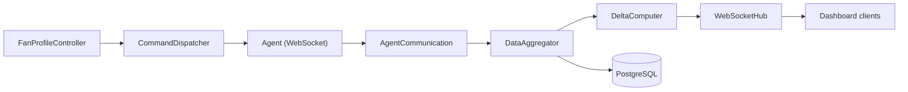

# Backend Architecture

For contributors working on the Pankha Fan Control server. The backend is a Node.js + TypeScript Express app with a WebSocket hub and PostgreSQL, living in the `backend/` workspace of the monorepo. For the concept-level view, read [How the Server Works](Server-Architecture) first.

## Layout

```text
backend/src/
├── index.ts          # Express app, router mounts, service startup
├── routes/           # REST routers (one file per API area)
├── services/         # The actual logic (below)
├── database/         # Connection pool + schema.sql
├── license/          # License tiers and activation
└── config/           # fan-profiles-defaults.json (SST)
```

## Services

Everything interesting lives in `backend/src/services/` - single-purpose classes wired together at startup:

| Service | Responsibility |
| :--- | :--- |
| `AgentManager` | Registry of all agents: status, per-agent settings (in-memory maps loaded from the database), error-state persistence |
| `AgentCommunication` | Agent WebSocket protocol: registration, data frames, error frames |
| `WebSocketHub` | The central WebSocket server; subscription topics (`systems:all`, `agents:all`) for dashboard clients |
| `DataAggregator` | Merges raw agent data with that system's settings into the shape the frontend consumes |
| `DeltaComputer` | Computes changed-values-only updates per client (the ~95% bandwidth saving) |
| `CommandDispatcher` | Sends commands to agents (fan speed, config changes) and tracks their completion |
| `FanProfileController` | The control loop: every tick (default 2000ms), evaluates curves + hysteresis + stepping and dispatches speed commands |
| `FanProfileManager` | Fan profile CRUD, curve points, assignments |
| `FanProfileTypeManager` | User-defined profile categories |
| `CalibrationService` | Calibration runs, measurement validation, health/trend data, stall tracking |
| `DownsamplingService` | Tiered history compression (1-min / 5-min / 30-min averages by age), scheduled daily |
| `ProfileService` | BMC profile catalog for IPMI agents: scans `backend/profiles/`, resolves `extends` inheritance |
| `UpdateDownloadService` | Hub staging: downloads release binaries so agents update from your server, not the internet |

## Data Flow



Two rules worth knowing before touching this pipeline:

*   **The database is authoritative; memory is a cache.** `AgentManager` holds settings in maps for speed, loaded from PostgreSQL on registration. Write to the database, then update the map.
*   **Agent lifecycle events must broadcast to both topics** (`agents:all` *and* `systems:all`) - the dashboard subscribes to `systems:all`, and events sent only to `agents:all` silently never reach it.

## Database

Schema lives in `backend/src/database/schema.sql` and auto-loads in Docker (`docker-entrypoint-initdb.d`). Core tables:

| Table | Purpose |
| :--- | :--- |
| `systems` | Registered agents + their configuration |
| `sensors` / `fans` | Hardware metadata, labels, visibility, ordering |
| `fan_profiles` / `fan_curve_points` / `fan_profile_assignments` | Profiles, their curves, and fan mappings |
| `fan_configurations` | Per-fan control settings (control sensor, limits) |
| `sensor_group_visibility` | Group-level show/hide |
| `monitoring_data` | Time-series history (downsampled by age) |
| `backend_settings` | Key/value server settings (see [API Reference](API-Reference) for the allowed keys) |
| `licenses` / `license_config` | License keys and active state |

## Conventions That Bite

*   **SST files**: dropdown value ladders come from `frontend/src/config/ui-options.json` and default profiles from `backend/src/config/fan-profiles-defaults.json` - edit the SST, never hardcode values in consumers.
*   **Delta discipline**: any new per-system field the dashboard should react to must be added to `DeltaComputer`'s tracked fields *and* the frontend's `React.memo` comparison ([Development: Frontend](Development-Frontend)) - miss either and the UI silently stops updating for that field.
*   **Log hygiene**: one log line per event or state change at INFO; per-tick chatter belongs at DEBUG/TRACE.

## Working On It

```bash
npm install            # once, at the repo root (npm workspaces)
npm run dev:backend    # ts-node with auto-restart on :3000
npm run typecheck
```

See [Building from Source](Development-Build) for the full environment and [API Reference](API-Reference) for the REST/WebSocket surface.

---

## Next Steps

*   [Development: Frontend](Development-Frontend): the other half of the codebase.
*   [How the Server Works](Server-Architecture): the same machinery, concept-level.
*   [Release Process](Development-Release-Process): how changes ship.
