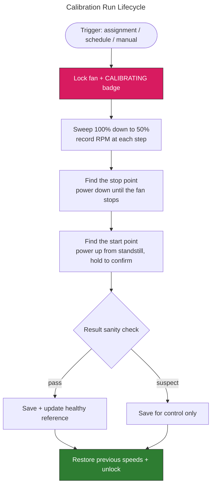

# Fan Calibration & Health

Pankha Fan Control measures every fan it manages instead of assuming they all behave the same. Calibration teaches the backend what each fan can actually do; the health view then uses those measurements to tell you when a fan is drifting away from its healthy self. This page explains what gets measured, when runs happen, and how to read the results.

## Why fans need calibrating

Real fans are not linear:

- **Dead zone** - below some power level a fan does not spin at all. A fan told to run at 20% may just sit there while a naive dashboard reports "20%, all good".
- **Start/stop asymmetry** - the power needed to start a fan from standstill is higher than the power needed to keep it spinning once started.
- **Different ceilings** - two fans set to 100% can differ by thousands of RPM.

Calibration measures, per fan:

| Measurement          | Meaning                                                             |
| :------------------- | :------------------------------------------------------------------ |
| Starts at            | Lowest power that reliably starts the fan from a standstill          |
| Stops below          | Lowest power that keeps it spinning once running                     |
| Speed range          | Slowest and top speed in RPM                                         |
| Response curve       | Actual RPM at each power step (the graph in the fan info card)       |
| Time to start / stop | How quickly the fan reacts                                           |
| Smallest step        | The smallest power change that produces a real speed change          |

With these facts, fan control skips the dead zone instead of crawling through it, never parks a fan at a power level where it silently stalls, and can tell "running as expected" from "something changed".

---

## When calibration runs

- **Automatically, once you assign a profile to a fan.** Assigning a profile is your consent to control that fan; unassigned fans are never touched automatically.
- **After updates that change how measuring works.** Old measurements are not comparable to new ones, so affected fans are re-measured once.
- **Periodically**, on the schedule you pick in **Settings > General > Backend Settings > Fan Recalibration** (default: every 7 days, or "Manual only" to disable).
- **When a fan outperforms its records.** If a fan sustains speeds above its known maximum (for example after you cleaned it or replaced it), its records are clearly stale and it is queued for a fresh measurement.
- **Manually**, any time, from the gauge icon next to a fan on its system card.

> If a run fails (for example the system was too warm, or went offline mid-run), Pankha retries automatically when the system is next available - with growing pauses between attempts, and after that on the regular recalibration schedule. Nothing gets stuck waiting for you.

---

## What a run looks like

- The fan shows a **CALIBRATING** badge and its manual controls lock for the few minutes the run takes.
- The fan sweeps from full speed down through its range, then briefly stops and restarts a few times - that is the start/stop measurement, and it is expected.
- Other fans on the system keep running normally (they are held at a safe speed while a fan is deliberately stopped).
- Everything is restored afterwards: previous speeds, update rate, and normal profile control.

> **Safety first:** a run aborts immediately if temperatures approach your emergency threshold, and an aborted run always restores the fan to its previous state.

---

## Trustworthy measurements

Real hardware lies in creative ways, so every reading has to earn its place:

- A speed reading only counts once it is **stable across several samples** - a fan mid-ramp cannot fake a measurement.
- A "start" only counts if the fan is **still spinning after a sustained hold** - a brief twitch of the blades does not count as starting.
- A reading only counts while the fan is **actually at the power level Pankha commanded**. Some systems have firmware or drivers that quietly move fans on their own (the Raspberry Pi's built-in fan logic and some GPU drivers do this); those samples are detected and discarded, and the run notes how many it threw away.
- After a run, the result is sanity-checked (does speed rise with power? is the peak at full power? is the ceiling believable?). A run that fails the check still works for fan control, but it is never allowed to redefine what "healthy" means for that fan.

---

## The fan info card

The info button next to each fan opens its card:

- **Health** - a verdict chip plus four plain-language checks (see below).
- **Calibration** - the measured facts and the response graph. The shaded area is the dead zone; the green dot is where the fan is running right now, including how far it is from the expected speed.
- **Info** - identity details and measurements, including the dead zone range and a count of unexpected stops (with a Clear button once you have fixed the cause).
- **How this works** - a short recap of this page, inside the app.

**Copy All** copies exactly what the card shows, for sharing or support.

---

## Health checks, in plain terms

Health compares the fan against **its own best self** - the best measurements it has ever produced - never against other fans. The verdict chip shows the worst of four checks:

| Check               | What it means                                                                     | When it complains                                                          |
| :------------------ | :--------------------------------------------------------------------------------- | :-------------------------------------------------------------------------- |
| Running as expected | Live speed vs. the calibration curve, judged over 10 minutes - never on a single reading | Sustained running slower (dust, obstruction) or faster (stale records) than measured |
| Top speed           | Latest measured ceiling vs. the best on record                                     | A falling ceiling - dust buildup is the usual cause                          |
| Dust and wear       | Trend across at least 3 calibration runs                                            | Top speed falling and/or the fan getting slower to start                     |
| Unexpected stops    | The fan read 0 RPM while being told to spin                                         | Check the cable if it keeps happening                                        |

> A fan's healthy reference never gets dragged down by recalibrating a dusty fan - degradation is a condition, not a new normal. It upgrades automatically the first time a run beats it (for example after cleaning).

You do not have to open the info card to notice a problem: when a health check degrades, the fan's badge on its card changes to **Attention** (yellow) or **Check fan** (red), with the reason in its tooltip. Healthy fans keep their normal badge - no news is good news.

---

## Good to know

- **Fans without a speed sensor** (no tach wire) cannot be measured. They are marked accordingly and simply behave as they always did.
- **Calibration runs count** in the card tells you how many measurements the trend checks are working with; wear verdicts need at least 3.
- Calibration measures **hardware facts** - your own min/max speed limits on a fan are always respected and never overwritten.

