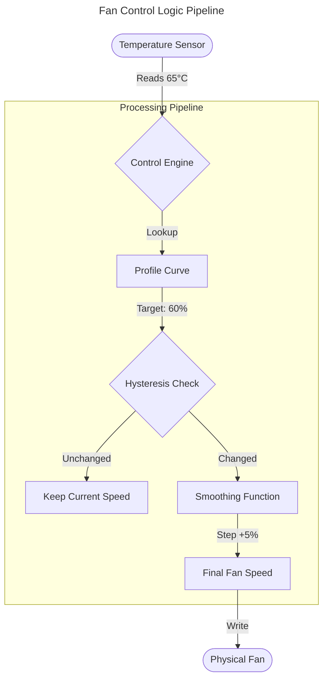

# Fan Profiles & Control Logic

Pankha provides a sophisticated control engine designed to keep your system quiet when idle and cool when under load. This page explains how the control logic works.

## Fan Profiles

A **Fan Profile** defines the relationship between a temperature source and a fan's speed. Pankha ships with several built-in profiles, and you can create your own custom curves.

### Built-in Profiles

| Profile            | Best For               | Behavior                                                                                         |
| :----------------- | :--------------------- | :----------------------------------------------------------------------------------------------- |
| **GPU Optimal**    | Graphics cards         | Fans stay off when cool, kick in at 50°C, and reach full speed by 75°C.                          |
| **Lazy**           | Chipset, high-RPM fans | Keeps fans completely off until 50°C, then slowly ramps up. Prioritizes silence over everything. |
| **Optimal**        | General use            | A good all-rounder. Fans spin gently at idle and ramp smoothly as temperatures climb.            |
| **Performance**    | Heavy workloads        | Fans are always spinning (40%+) and ramp aggressively. Keeps things cool at the cost of noise.   |
| **Standard**       | Most systems           | A straightforward linear curve from low to high. Predictable and reliable.                       |
| **Raspberry Pi 5** | SoC and ARM boards     | Stays silent until 55°C, then ramps quickly. Tuned for small boards with high-RPM fans.          |

All built-in profiles can be used as-is or duplicated and adjusted to suit your hardware.

### Control Logic

How does Pankha decide what speed to run a fan at?

1.  **Sensor Reading**: Reads the Assigned Control Sensor (e.g., "CPU Package").
2.  **Curve Lookup**: Finds the target speed for that temperature on the active profile curve.
3.  **Hysteresis Check**: Ignores small, rapid temperature fluctuations (see below).
4.  **Smoothing**: Gradually adjusts the current speed to the new target (see "Fan Step").

---

## Assigning a Fan Profile

Each fan can be assigned:
*   A **Fan Profile** (the curve that determines speed behavior).
*   A **Control Sensor** (the temperature source that drives the curve).

Both are selected from dropdowns on each fan's row in the dashboard.

---

## Control Sensor Selection

When assigning a control sensor to a fan, you have three options:

### Individual Sensor

Select a specific sensor (e.g., "CPU Package", "GPU Core"). The fan speed is based entirely on that single sensor's temperature.

### Highest Temperature

Select **"Highest"** to use the **maximum temperature across all visible sensors** on that system. This is ideal for exhaust or case fans that should respond to whatever is hottest.

*   Only **visible** sensors are included. If you hide a sensor (see [Advanced Settings](Agents-Advanced-Settings)), it is excluded from the highest calculation.
*   This lets you declutter noisy or irrelevant sensors without affecting your fan behavior, or intentionally exclude sensors you don't want driving your fans.

### Sensor Group

Select a **sensor group** (e.g., "k10temp", "nvme") to use the highest temperature within that group only. Useful when you want a fan to respond to a specific hardware component:

| Group Example | Sensors Included             | Use Case       |
| :------------ | :--------------------------- | :------------- |
| `k10temp`     | All CPU core sensors (AMD)   | CPU fans       |
| `coretemp`    | All CPU core sensors (Intel) | CPU fans       |
| `nvme`        | All NVMe drive temperatures  | Drive bay fans |
| `it8628`      | All motherboard chip sensors | Case fans      |

> Groups are based on the hardware chip name reported by your system. The available groups will vary depending on your hardware.

---

## Custom Fan Curves

When using the **Custom** profile type, you define your own temperature-to-speed curve with as many control points as you need.

*   Open the **Fan Profile Manager** from the fan's profile dropdown.
*   Add or edit control points on the curve graph.
*   Each point maps a temperature (X-axis) to a fan speed percentage (Y-axis).
*   The fan speed is linearly interpolated between points.

**Example custom curve:**

| Temperature | Fan Speed |
| :---------- | :-------- |
| 30°C        | 20%       |
| 50°C        | 40%       |
| 65°C        | 70%       |
| 80°C        | 100%      |

At 57°C, the fan would run at approximately 55% (interpolated between the 50°C and 65°C points).

---

## Bulk Edit

If you have many fans on a system, you can update multiple fans at once using the **Bulk Edit** panel.

1.  Click the **Bulk Edit** button on a system card.
2.  Select the fans you want to change (or use **Select All**).
3.  Choose a **Fan Profile** and/or **Control Sensor** to apply.
4.  The selected settings are applied to all checked fans in one action.

This is especially useful when setting up a new system for the first time, or when changing the profile for all case fans at once.

---

## Related

*   [Advanced Settings](Agents-Advanced-Settings): Hysteresis, Fan Step, Emergency Temperature, and Sensor Visibility settings that affect fan control.
*   [Troubleshooting](Troubleshooting): Fan control not working or fans not responding.

