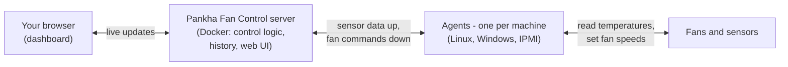

# Welcome to Pankha Fan Control (पंखा)

Pankha Fan Control is an open-source, distributed fan control system for self-hosters and hardware enthusiasts. It monitors and controls hardware cooling across all your machines - PCs, NAS boxes, servers - from a single, centralized dashboard.

## Key Features

*   **Centralized Control**: manage fan curves and speeds for your NAS, gaming PC, and rack servers from one dashboard ([Dashboard](Dashboard)).
*   **Automatic Fan Curves**: temperature-driven profiles with hysteresis and smooth stepping - quiet at idle, cool under load ([Fan Profiles](Fan-Profiles)).
*   **Fan Calibration & Health**: each fan's real usable speed range is measured automatically, and failing fans are flagged ([Calibration & Health](Fan-Calibration)).
*   **Virtual Sensors**: combine any sensors into one - "hottest of my NVMe drives" can drive the drive-bay fan ([Dashboard](Dashboard)).
*   **Cross-Platform Agents**: Linux (single Rust binary, <10MB RAM), Windows (.NET 8 service + tray app), and IPMI for enterprise servers with a BMC ([Linux](Agents-Linux) / [Windows](Agents-Windows) / [IPMI](Agents-IPMI)).
*   **Real-time Monitoring**: WebSocket-based updates with sub-second latency, sparklines, and historical graphs.
*   **Hardware Safety**:
    *   **Failsafe Mode**: agents keep fans at a safe speed on their own if the server becomes unreachable.
    *   **Emergency Override**: all fans to 100% the moment any sensor crosses your critical threshold.
    *   **Emergency Stop**: one button forces every fan on every system to maximum.
*   **Historical Data**: PostgreSQL storage for temperature and fan speed analysis, with configurable retention.
*   **Privacy Centric**: zero cloud dependency - agents connect only to your server, never the internet ([Agent Philosophy](Agent-Philosophy)).
*   **Self-Hostable**: the whole system runs on your own hardware via Docker Compose.

## Architecture

One server runs the brains; a small agent on each machine does only what it's told:

All decisions - curves, thresholds, calibration - happen on the server. Agents are deliberately simple relays, which is why they are safe to put on every machine you own ([Agent Philosophy](Agent-Philosophy)).

## Getting Started

1.  **[Quick Start](Quick-Start)**: from nothing installed to fans under automatic control, in five steps.
2.  **[Server Installation](Server-Installation)**: the full server setup reference (Docker Compose, `.env`, ports).
3.  **[Deployment Center](Deployment-Center)**: roll agents out to the rest of your machines.
4.  **[Dashboard](Dashboard)**: a tour of everything on screen.
