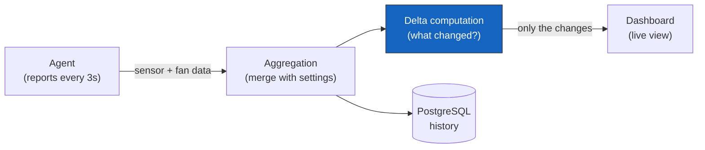

# How the Server Works

The Pankha Fan Control server is the system's brain - agents and the dashboard are satellites around it. This page explains what actually happens inside: how a temperature reading becomes a fan command, what gets stored, and what happens when pieces disconnect. It's the server-side counterpart to [Agent Philosophy](Agent-Philosophy).

One fact frames everything else: **fan control runs on the server, not in your browser.** The dashboard is just a window - close it, and your curves keep running exactly the same.

## The Control Loop

The server re-decides every fan's speed on a fixed tick - the **System Responsiveness** setting in the dashboard header, from Real-time (500ms) to Very Slow (10s), default 2 seconds. Each tick, for every fan with a profile:

1.  Read the fan's control sensor (a real sensor, a group, a virtual sensor, or "Highest").
2.  Look up the target speed on the profile curve.
3.  Apply hysteresis (ignore tiny fluctuations) and fan step (move gradually).
4.  If the speed should change, send the command to the agent.

The full logic is explained in [Fan Profiles & Logic](Fan-Profiles). The loop runs entirely server-side against the latest data agents have reported - which is why the agent's own rate (default 3s) and the controller tick are separate, independently tunable settings.

## The Data Pipeline

Agents report at their configured rate; the server merges each report with that system's settings and works out **what actually changed** since the last update. Only those changes go to the dashboard - a delta of roughly half a kilobyte instead of a full ~15KB snapshot, about a 95% bandwidth saving. That's why the dashboard stays smooth with dozens of systems connected, even over Wi-Fi on a phone.

A full snapshot is sent once when the dashboard connects; everything after that is deltas.

## What Gets Stored

Live readings pass through to the dashboard; history lands in PostgreSQL. To keep a year of data small, history is **progressively summarized** as it ages:

| Age | Resolution |
| :--- | :--- |
| Under 24 hours | 1-minute averages |
| 1 to 30 days | 5-minute averages |
| Older than 30 days | 30-minute averages |

Summarization runs automatically once a day. Two dashboard settings control the rest ([Settings](Settings-Page)): **Data Retention** caps how far back history goes, and **Hardware Pruning** cleans up records of fans that are no longer detected.

## When Things Disconnect

| What goes down | What happens |
| :--- | :--- |
| **Your browser** | Nothing. Control runs on the server; the dashboard is only a viewer. |
| **An agent** | The agent protects itself **immediately**: the moment the connection drops it goes to your failsafe speed with local emergency-temperature protection ([Agent Philosophy](Agent-Philosophy)). The server takes up to ~15 seconds to *notice* and flip the dashboard badge to offline - purely cosmetic lag; the machine was already safe. |
| **The server** | Every agent independently enters failsafe - safe speed plus local emergency watch - and reconnects automatically when the server returns. Control resumes without any action from you. |

There is no scenario where fans are left uncontrolled: either the server is driving them, or the agent's failsafe is.

---

## Next Steps

*   [Agent Philosophy](Agent-Philosophy): the other half of the story - what agents do and deliberately don't do.
*   [Fan Profiles & Logic](Fan-Profiles): the decision-making inside the control loop.
*   [Settings](Settings-Page): retention, pruning, and the responsiveness tick.
*   [Development: Backend](Development-Backend): the same architecture at code level, for contributors.
