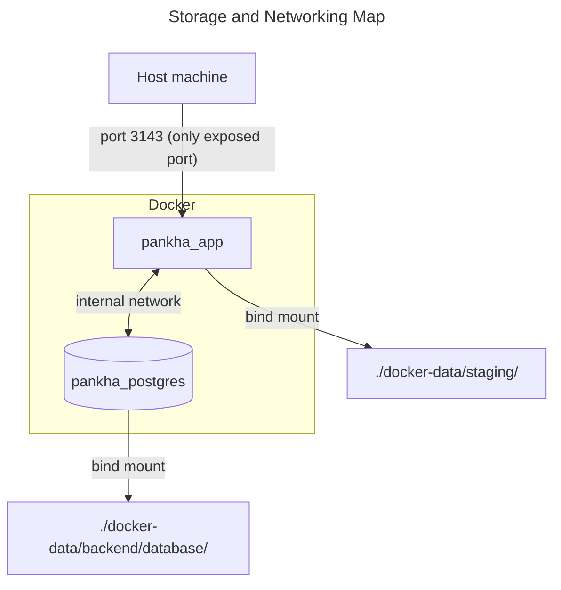

# Server Configuration

The Pankha Fan Control server is configured through environment variables in your `.env` file (see [Server Installation](Server-Installation) for the initial setup).

## Environment Variables

| Variable | Description | Default |
| :--- | :--- | :--- |
| `PANKHA_HUB_IP` | This server's LAN IP/hostname - used to build agent install commands | **must be set** |
| `PANKHA_PORT` | Dashboard + agent port (HTTP and WebSocket) | `3143` |
| `POSTGRES_USER` / `POSTGRES_PASSWORD` / `POSTGRES_DB` | Database credentials and name | **set your own** |
| `POSTGRES_HOST` / `POSTGRES_PORT` | Database location - change only for an external PostgreSQL | `pankha-postgres` / `5432` |
| `TIMEZONE` | Timezone for dashboard times and logs | `UTC` |
| `LOG_LEVEL` | Server log verbosity (`error`/`warn`/`info`/`debug`/`trace`) | `info` |
| `PANKHA_STAGING_DIR` | In-container path for staged agent binaries | leave as-is |
| `POSTGRES_MAX_WAL_SIZE`, `POSTGRES_MIN_WAL_SIZE`, `POSTGRES_CHECKPOINT_TIMEOUT`, `POSTGRES_WAL_KEEP_SIZE` | PostgreSQL disk-usage tuning | leave as-is |

> The backend builds its database connection from the `POSTGRES_*` variables. A raw `DATABASE_URL` is accepted only as a legacy fallback when those are absent - prefer the individual variables.

Some settings also have a **runtime home in the dashboard** - log level, data retention, and hardware pruning live in [Settings](Settings-Page) and take effect without a restart.

> Looking for something not listed here - accepted values for each variable, the authentication settings, running without Compose, an external PostgreSQL, or a reverse proxy? [Docker & Env](Docker-and-Env) is the complete reference.

---

## Custom Port

If port 3143 is already in use, change it in your `.env` file:

```bash
PANKHA_PORT=7000
```

Then restart:

```bash
docker compose down
docker compose up -d
```

> **Note**: agents connect to this port too. Existing agents need their server URL updated (Linux: `sudo ./pankha-agent --setup`; Windows: tray **Configure...**).

---

## Stopping the Server

To stop all services:

```bash
docker compose down
```

While the server is down, agents hold their failsafe speed and keep local emergency-temperature protection - nothing overheats, but nothing follows your curves either ([Agent Philosophy](Agent-Philosophy)).

---

## Data & Storage Layout

All persistent data lives in `docker-data/`, **next to your `compose.yml`** - plain folders on the host (bind mounts), not hidden Docker volumes:

```text
pankha/
├── compose.yml          # Container orchestration - don't edit (see Server Installation)
├── .env                 # All your configuration
└── docker-data/
    ├── backend/database/postgres_data/   # PostgreSQL data (all history, profiles, settings)
    └── staging/                          # Agent binaries staged by the Deployment Center
```


```mermaid
---
title: Storage and Networking Map
---
graph TD
    Host[Host machine]

    subgraph "Docker"
        App["pankha_app"]
        DB[("pankha_postgres")]
    end

    Host -->|"port 3143 (only exposed port)"| App
    App <-->|internal network| DB
    DB -->|bind mount| Files["./docker-data/backend/database/"]
    App -->|bind mount| Staging["./docker-data/staging/"]
```

What this means in practice:

*   **Backup** = copy the `pankha/` folder (stop the stack first for a consistent database copy).
*   **Move to another machine** = copy the folder, run `docker compose up -d` there.
*   **Delete everything** = delete the folder. `docker compose down -v` does **not** remove your data - it only removes Docker-managed volumes, and your data lives in the folder, not in one.
*   The database is reachable **only** from the app container - no PostgreSQL port is exposed to your network.

## Next Steps

*   [Settings](Settings-Page): the server settings that live in the dashboard (retention, pruning, recalibration, appearance).
*   [Advanced Settings](Agents-Advanced-Settings): per-agent configuration - hysteresis, fan step, emergency temperature.
