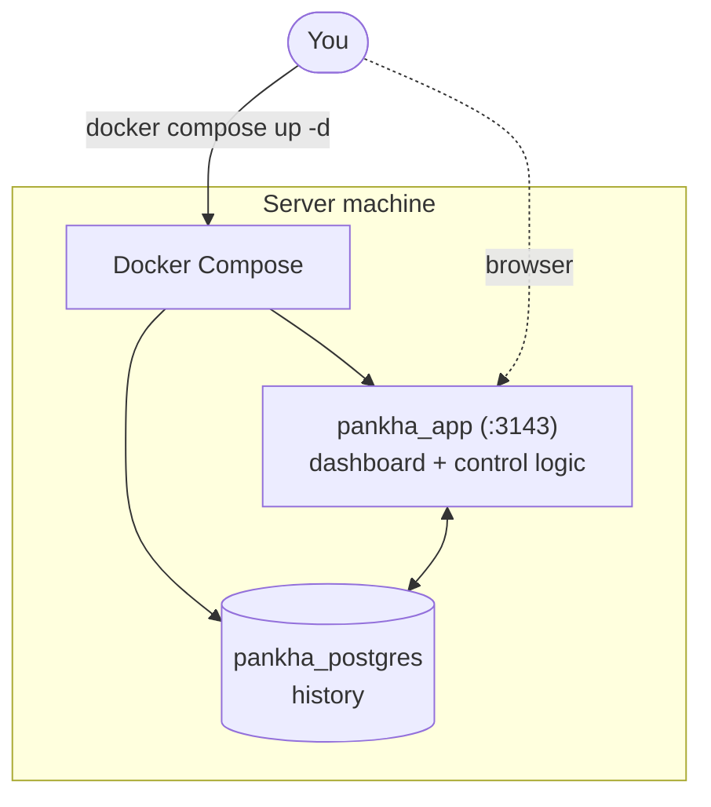

# Server Installation

The Pankha Fan Control server is deployed with Docker Compose: one app container (dashboard + control logic) and one PostgreSQL container (history). This page is the full setup reference - if you just want fans spinning, the [Quick Start](Quick-Start) covers the fast path.

## Prerequisites

*   Docker Engine with the Docker Compose plugin.
*   A machine that's always on - the server is the brain; when it's down, agents fall back to their failsafe speed.
*   Resources are modest: a few hundred MB of RAM; disk grows with your data-retention setting.

## 1. Download the Release Files

Every release ships the production `compose.yml` and an `example.env`. Use them as-is:

```bash
mkdir pankha && cd pankha
wget https://github.com/Anexgohan/pankha/releases/latest/download/compose.yml
wget https://github.com/Anexgohan/pankha/releases/latest/download/example.env -O .env
```

> **Don't hand-edit `compose.yml`** - all normal customization happens in `.env`. The one exception is the image tag (see [Release Channels](#release-channels)).

## 2. Configure `.env`

Open `.env` in an editor. The top section is marked **REQUIRED CONFIGURATION**:

| Variable | Required? | What it does |
| :--- | :--- | :--- |
| `PANKHA_HUB_IP` | **Yes** | This server's LAN IP or hostname (e.g. `192.168.1.100`). Agent install commands are built from it - the shipped placeholder will not work. |
| `POSTGRES_USER` / `POSTGRES_PASSWORD` | **Yes** | Your database credentials - pick your own. |
| `PANKHA_PORT` | No (default `3143`) | The port the dashboard and agents connect to. |
| `TIMEZONE` | No (default UTC) | Uncomment and set (e.g. `Asia/Kolkata`) so dashboard times and logs match your clock. |
| `LOG_LEVEL` | No (default `info`) | Server log verbosity - also changeable later from the dashboard's [Settings](Settings-Page). |
| `POSTGRES_DB` / `POSTGRES_HOST` / `POSTGRES_PORT` | No | Leave at defaults for the bundled database container. |
| `PANKHA_STAGING_DIR` | No | Where staged agent binaries live inside the container - leave as-is. |
| `POSTGRES_MAX_WAL_SIZE` and friends | No | PostgreSQL disk-usage tuning - leave as-is unless you know why. |

> **External PostgreSQL** (advanced): the backend builds its database connection from the `POSTGRES_*` variables, so pointing `POSTGRES_HOST`/`POSTGRES_PORT` at an existing PostgreSQL instance works - load `backend/src/database/schema.sql` into it yourself, and don't start the bundled `pankha-postgres` service.

## 3. Start It

```bash
docker compose pull && docker compose up -d
```

The dashboard is at `http://<server-ip>:3143` (or your `PANKHA_PORT`).

### Deployment Architecture



## Verification

```bash
docker compose ps          # both containers Up (healthy)
curl http://localhost:3143/health
```

Both services have healthchecks - the app waits for the database to be healthy before starting.

## Release Channels

The image tag in `compose.yml` picks your channel - this is the one line in the compose file you may want to edit:

| Tag | Meaning |
| :--- | :--- |
| `anexgohan/pankha:latest` | Stable releases (default) |
| `anexgohan/pankha:beta` | Absolute latest |
| `anexgohan/pankha:testing` | Pre-releases |

## Where Data Lives

Everything persistent sits next to your `compose.yml`, so backing up the folder backs up the system:

```text
pankha/
├── compose.yml
├── .env
└── docker-data/
    ├── backend/database/postgres_data/   # PostgreSQL data
    └── staging/                          # Staged agent binaries (Deployment Center)
```

The PostgreSQL container's ports are deliberately **not** exposed to the network - only the app talks to it.

## Updating

```bash
docker compose down && docker compose pull && docker compose up -d
```

Your `.env`, database, and staged binaries are untouched by updates.

---

## Next Steps

*   [Quick Start](Quick-Start): deploy your first agent and put a fan under control.
*   [Server Configuration](Server-Configuration): environment variables and runtime settings in depth.
*   [Deployment Center](Deployment-Center): roll agents out to your machines.
